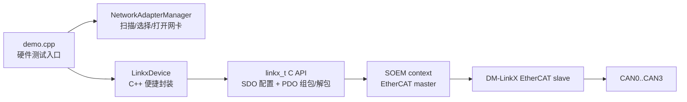
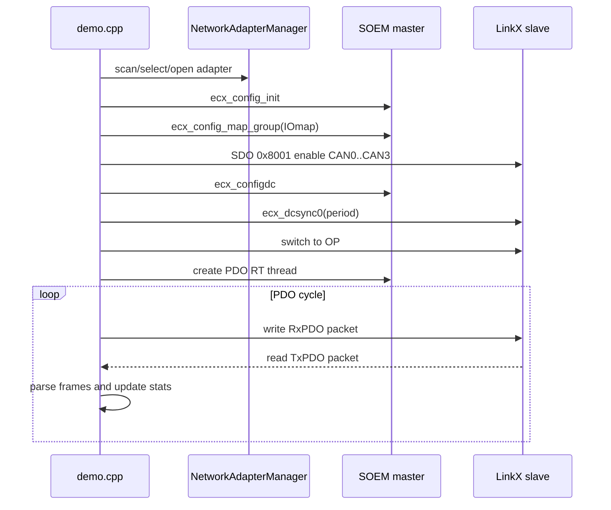

# linkx_soem_demo

> 免责声明：此 demo 为纯 vibe coding 产物，仅供学习、验证和参考使用。代码没有经过完整工程化评审、长期稳定性测试或生产环境验证，不建议直接作为生产代码使用。

这是一个基于 SOEM 的 DM-LinkX EtherCAT 转 CAN/CANFD 模块示例工程。工程使用 C++20 封装了网卡管理、LinkX 对象字典配置、PDO 组包/解包和硬件 demo，适合用来验证 LinkX 模块的 CAN/CANFD 收发、PDO 周期和 DC Sync0 同步行为。

当前 demo 的典型接线方式：

```text
CAN0 <-> CAN1
CAN2 <-> CAN3
```

demo 会在 4 个 CAN 通道上轮询发送 CANFD+BRS 测试帧，接收侧通过 payload 中的通道号和序号统计丢帧、乱序、WKC 和 PDO 解析状态。

## 工程约定

- 本工程的业务封装代码在 `inc/linkx` 和 `src/linkx`。
- 硬件测试入口在 `src/demo.cpp`。
- `inc/soem` 和 `lib/soem/soem.lib` 是第三方 SOEM 头文件和库文件，默认不要修改。
- `inc/npcap` 和 `lib/npcap` 是 Npcap/WinPcap 兼容接口相关文件，默认不要修改。

## 目录结构

```text
.
├── CMakeLists.txt
├── README.md
├── inc
│   ├── linkx
│   │   ├── linkx.h
│   │   └── network_adapter_manager.h
│   ├── soem
│   └── npcap
├── lib
│   ├── soem
│   └── npcap
└── src
    ├── demo.cpp
    └── linkx
        ├── linkx.cpp
        └── network_adapter_manager.cpp
```

## 总体结构



## 功能概览

- 扫描当前系统中 SOEM/Npcap 可用网卡。
- 支持用网卡索引或名称片段选择网卡，例如 `1`、`USB`、`Intel`。
- 打开指定网卡作为 EtherCAT master。
- 发现并初始化 LinkX EtherCAT 从站。
- 映射 PDO 到本地 `IOmap`。
- 通过 SDO `0x8001` 打开或关闭 CAN0..CAN3。
- 支持通过 SDO `0x8002` / `0x8003` 写入和读取 CAN/CANFD 位时序配置。
- 使用两个 255 字节 PDO buffer 拼接 510 字节 CAN 帧包。
- 支持按 DLC 只拷贝有效 payload，避免每帧固定占用 64 字节。
- demo 使用 SOEM 的 `osal_thread_create_rt()` 创建 PDO 周期线程。
- demo 开启 DC Sync0，并打印 DC 状态。

## 运行环境

推荐环境：

- Windows 10/11
- Visual Studio/MSVC 工具链
- CMake 3.20 或更高
- Npcap 运行时，建议安装时勾选 WinPcap API-compatible Mode
- 一张独立有线网卡或 USB 有线网卡连接 EtherCAT 设备
- 以管理员权限运行终端，避免 Npcap 打开网卡失败

实测常用网卡：

```text
Realtek USB FE Family Controller
```

运行 demo 时可以直接用 `USB` 作为网卡选择参数。

## 构建

在 Visual Studio Developer PowerShell 或已经加载 MSVC 环境变量的终端中执行：

```powershell
cmake -S . -B build -G Ninja
cmake --build build
```

如果已经存在 `build` 目录，也可以直接构建：

```powershell
cmake --build build --config Debug
```

生成程序：

```powershell
.\build\linkx_soem_demo.exe
```

如果普通 PowerShell 找不到 `cstddef`、`windows.h` 或 MSVC 编译器，需要先进入 Visual Studio Developer PowerShell，或手动调用 `VsDevCmd.bat`。

## 快速开始

### 1. 列出网卡

```powershell
.\build\linkx_soem_demo.exe --list
```

示例输出：

```text
Available adapters:
   0 - \Device\NPF_{...}  (Hyper-V Virtual Ethernet Adapter)
   1 - \Device\NPF_{...}  (Realtek USB FE Family Controller)
   2 - \Device\NPF_{...}  (Intel(R) Ethernet Connection ...)
   3 - \Device\NPF_Loopback  (Adapter for loopback traffic capture)
```

建议选择连接 LinkX 模块的有线网卡，不要选择 Wi-Fi、Loopback 或虚拟网卡。

### 2. 运行硬件 demo

命令格式：

```powershell
.\build\linkx_soem_demo.exe <adapter_index_or_name> [run_seconds] [slave_id] [frames_per_cycle] [pdo_period_us]
```

参数说明：

| 参数 | 默认值 | 说明 |
| --- | --- | --- |
| `adapter_index_or_name` | 必填 | 网卡索引，或网卡名称/描述中的一段文本，例如 `1`、`USB`、`Intel` |
| `run_seconds` | `10` | 运行秒数，填 `0` 表示持续运行 |
| `slave_id` | `1` | LinkX 在 SOEM 从站列表中的编号，从 `1` 开始 |
| `frames_per_cycle` | `4` | 每个 PDO 周期打包发送的 CAN/CANFD 帧数 |
| `pdo_period_us` | `300` | 目标 PDO 周期，单位微秒 |

示例：

```powershell
.\build\linkx_soem_demo.exe USB 2 1 4 800
.\build\linkx_soem_demo.exe USB 2 1 28 800
.\build\linkx_soem_demo.exe 1 10 1 4 1000
```

`frames_per_cycle=28` 时，8 字节 payload 的 CANFD 帧会基本塞满 508 字节有效 PDO 空间：

```text
sizeof(can_frame_head_t) = 10
payload = 8
每帧占用 18 字节
28 * 18 = 504 字节
PDO data_buf 总容量 = 508 字节
```

## demo 启动流程



## LinkX 对象字典

本工程使用的对象字典如下。

| Index | 名称 | 方向 | 长度/子项 | 用途 |
| --- | --- | --- | --- | --- |
| `0x6001` | Can Recv TxPDO Buffer0 | 从站到主站 | 255 字节 | CAN 接收数据 TxPDO 前半段 |
| `0x6002` | Can Recv TxPDO Buffer1 | 从站到主站 | 255 字节 | CAN 接收数据 TxPDO 后半段 |
| `0x7001` | Can Send RxPDO Buffer0 | 主站到从站 | 255 字节 | CAN 发送数据 RxPDO 前半段 |
| `0x7002` | Can Send RxPDO Buffer1 | 主站到从站 | 255 字节 | CAN 发送数据 RxPDO 后半段 |
| `0x8001` | Can Channel Enabled | SDO | subindex 1..8 | CAN 通道开关 |
| `0x8002` | Can Channel Baudrate Write | SDO | subindex 1..0B | 写入位时序 |
| `0x8003` | Can Channel Baudrate Read | SDO | subindex 1..0B | 读取位时序 |

### 0x8001 CAN 通道开关

| SubIndex | 含义 | 类型 | 访问 |
| --- | --- | --- | --- |
| `0x01` | CAN0 Channel Enabled | bool | R/W |
| `0x02` | CAN1 Channel Enabled | bool | R/W |
| `0x03` | CAN2 Channel Enabled | bool | R/W |
| `0x04` | CAN3 Channel Enabled | bool | R/W |
| `0x05..0x08` | Reserved | - | - |

C++ API 中通道号从 `0` 开始，所以：

```text
API channel 0 -> SDO subindex 0x01
API channel 1 -> SDO subindex 0x02
API channel 2 -> SDO subindex 0x03
API channel 3 -> SDO subindex 0x04
```

### 0x8002 / 0x8003 位时序

`can_baudrate_setting_t` 与对象字典子索引顺序一致：

```cpp
struct can_baudrate_setting_t
{
    std::uint8_t channel;
    std::uint8_t enable_canfd;
    std::uint8_t nominal_prescaler;
    std::uint8_t nominal_seg1;
    std::uint8_t nominal_seg2;
    std::uint8_t nominal_sjw;
    std::uint8_t data_prescaler;
    std::uint8_t data_seg1;
    std::uint8_t data_seg2;
    std::uint8_t data_sjw;
};
```

写入流程：

1. 从站切到 SAFE_OP。
2. 写 `0x8002:01..0A`。
3. 写 `0x8002:0B = 1` 使配置生效。
4. 重新调用 `linkx.start()` 进入 OP 后继续 PDO。

读取流程：

1. 从站切到 SAFE_OP。
2. 写 `0x8003:01 = channel`。
3. 写 `0x8003:0B = 1` 触发读取。
4. 读 `0x8003:01..0A`。
5. 重新调用 `linkx.start()` 进入 OP 后继续 PDO。

## PDO 数据格式

LinkX 的 CAN PDO 包由两个 255 字节 buffer 拼接而成，总长度 510 字节：

```cpp
#pragma pack(push, 1)
struct packet_buf_t
{
    std::uint16_t nbytes;
    std::uint8_t data_buf[508];
};
#pragma pack(pop)
```

- `nbytes` 表示 `data_buf` 中有效字节数。
- `data_buf` 中连续存放若干个 CAN/CANFD 帧。
- 每帧实际占用 `sizeof(can_frame_head_t) + payload_size`。
- `payload_size` 由 DLC 映射得到，不是固定 64 字节。

CAN/CANFD 帧头：

```cpp
#pragma pack(push, 1)
struct can_frame_head_t
{
    std::uint32_t can_id : 29;
    std::uint32_t esi : 1;
    std::uint32_t rtr : 1;
    std::uint32_t ext : 1;

    std::uint8_t brs : 1;
    std::uint8_t canfd : 1;
    std::uint8_t reserved : 2;
    std::uint8_t dlc : 4;
    std::uint8_t channel;
    std::uint32_t timestamp;
};

struct can_frame_t
{
    can_frame_head_t head;
    std::uint8_t payload[64];
};
#pragma pack(pop)
```

当前静态检查：

```text
sizeof(can_frame_head_t) = 10
sizeof(packet_buf_t) = 510
```

### DLC 映射表

| DLC | Payload 字节数 |
| --- | --- |
| 0 | 0 |
| 1 | 1 |
| 2 | 2 |
| 3 | 3 |
| 4 | 4 |
| 5 | 5 |
| 6 | 6 |
| 7 | 7 |
| 8 | 8 |
| 9 | 12 |
| 10 | 16 |
| 11 | 20 |
| 12 | 24 |
| 13 | 32 |
| 14 | 48 |
| 15 | 64 |

注意：组包时不要把 `payload[64]` 全量塞进 PDO。对于 8 字节电机帧，只应拷贝 8 字节 payload，否则会严重浪费 508 字节组包空间。

## C++ API 使用

### 网卡管理

`NetworkAdapterManager` 负责扫描、选择和打开 SOEM 网卡：

```cpp
ecx_contextt ctx = {};
NetworkAdapterManager adapter_manager(ctx);

adapter_manager.scan();
adapter_manager.show_adapters(std::cout);
adapter_manager.select_adapter(1);
adapter_manager.open_selected_adapter();
```

也可以直接：

```cpp
adapter_manager.open_adapter(1);
```

### LinkX 最小流程

```cpp
#include "linkx.h"
#include "network_adapter_manager.h"
#include "soem.h"

#include <cstdint>
#include <iostream>

int main()
{
    ecx_contextt ctx = {};
    std::uint8_t IOmap[4 * 1024] = {};

    NetworkAdapterManager adapter_manager(ctx);
    adapter_manager.scan();
    if (!adapter_manager.open_adapter(1))
    {
        std::cout << "open adapter failed\n";
        return 1;
    }

    const int slave_count = ecx_config_init(&ctx);
    if (slave_count <= 0)
    {
        std::cout << "no slave found\n";
        return 1;
    }

    ecx_config_map_group(&ctx, IOmap, 0);
    const int expected_wkc = ctx.grouplist[0].outputsWKC * 2 +
                             ctx.grouplist[0].inputsWKC;

    ecx_statecheck(&ctx, 0, EC_STATE_SAFE_OP, EC_TIMEOUTSTATE * 2);

    LinkxDevice linkx;
    linkx.init(1, ctx);

    if (!linkx.set_all_can_channels_enabled(true))
    {
        std::cout << "enable CAN channels failed\n";
        return 1;
    }

    ecx_configdc(&ctx);
    ecx_dcsync0(&ctx, 1, true, 800000, 1000);

    if (!linkx.start())
    {
        std::cout << linkx_get_error_string(&linkx.raw()) << "\n";
        return 1;
    }

    const std::uint8_t payload[8] = {0, 1, 2, 3, 4, 5, 6, 7};

    linkx.clear_output_packet();
    linkx.append_output_can_frame(
        0,        // CAN channel
        0x123,    // CAN ID
        true,     // CANFD
        true,     // BRS
        false,    // ext
        false,    // rtr
        payload,
        sizeof(payload));

    const int wkc = linkx.exchange_processdata(EC_TIMEOUTRET);
    if (wkc >= expected_wkc)
    {
        linkx.foreach_input_frame(
            [](const can_frame_t* frame, void*) {
                // 在这里处理收到的 CAN/CANFD 帧。
                (void)frame;
            },
            nullptr);
    }

    linkx.stop();
    ecx_dcsync0(&ctx, 1, false, 800000, 1000);
    adapter_manager.close();
    return 0;
}
```

常用接口：

| API | 说明 |
| --- | --- |
| `set_can_channel_enabled(channel, enable)` | 开关单个 CAN 通道 |
| `set_all_can_channels_enabled(enable)` | 开关全部 CAN 通道 |
| `read_baudrate(channel, setting)` | 读取 CAN/CANFD 位时序 |
| `write_baudrate(channel, setting)` | 写入 CAN/CANFD 位时序 |
| `clear_output_packet()` | 清空本周期准备发送的 PDO 包 |
| `append_output_can_frame(...)` | 创建并追加一帧 CAN/CANFD |
| `append_output_frame(frame)` | 追加已构造好的 `can_frame_t` |
| `exchange_processdata(timeout)` | 写 RxPDO、收 TxPDO 并更新输入包 |
| `foreach_input_frame(callback, user_data)` | 遍历输入 PDO 中的所有 CAN/CANFD 帧 |
| `start()` | 切 OP |
| `stop()` | 切 SAFE_OP |

## demo 发送帧规则

demo 中每个 PDO 周期会按 `frames_per_cycle` 组包发送多帧，不是一周期只发一帧。

发送配置：

```text
canfd = true
brs   = true
ext   = false
rtr   = false
can_id = channel + 1
channel = 0,1,2,3 round-robin
payload size = 8
```

payload 格式：

```text
byte0    origin channel
byte1-4  little-endian sequence
byte5    0xAA
byte6    0x55
byte7    0x5A
```

这个格式用于主站侧统计：

- 每个源通道发了多少帧。
- 每个物理接收通道收了多少帧。
- 是否有缺失序号。
- 是否有乱序。
- 是否有非 demo payload。

## DC 和 PDO 线程

demo 当前会开启 DC Sync0：

```cpp
ecx_configdc(&ctx);
ecx_dcsync0(&ctx, slave_id, true, pdo_period_us * 1000, 1000);
```

启动时会打印类似：

```text
ecx_configdc result=1
DC status [after ecx_configdc]: slave_hasdc=1 group_hasdc=1 DCactive=0
DC status [after ecx_dcsync0 on]: slave_hasdc=1 group_hasdc=1 DCactive=1 DCcycle=800000 ns DCshift=1000 ns
```

含义：

| 字段 | 含义 |
| --- | --- |
| `slave_hasdc` | 从站是否支持 DC |
| `group_hasdc` | 当前 SOEM group 是否存在 DC 从站 |
| `DCactive` | Sync0 是否已配置启用 |
| `DCcycle` | Sync0 周期，单位 ns |
| `DCshift` | Sync0 相位偏移，单位 ns |

PDO 循环运行在 SOEM `osal_thread_create_rt()` 创建的线程中。Windows 不是硬实时系统，`THREAD_PRIORITY_TIME_CRITICAL` 只能改善调度优先级，不能保证精确微秒级周期。

## 运行统计说明

运行时每秒打印一次统计，例如：

```text
[2s elapsed=2.000s cycles=2346 rate=1172.7/s] pdo_queued=65688 pdo_acked=65660 rx_frames=36724 ack_rx_delta=28936 wkc_ok=2345 wkc_bad=1 last_wkc=3 parse_errors=0
     pdo input nonempty=2240 empty=105
     queued ch0=16422 ch1=16422 ch2=16422 ch3=16422 append_fail=0
     acked  ch0=16415 ch1=16415 ch2=16415 ch3=16415 expected_wkc=3
     rx physical ch0=9314 ch1=9124 ch2=9167 ch3=9119 bad=0 invalid_payload=0
     rx origin   ch0=9122 ch1=9308 ch2=9125 ch3=9169 | missing ch0=7309 ch1=7119 ch2=7306 ch3=7261 | out_of_order=70
```

字段含义：

| 字段 | 说明 |
| --- | --- |
| `cycles` | 已执行的 PDO 交换周期数 |
| `rate` | 实际 PDO 循环频率 |
| `pdo_queued` | 已成功放入输出 PDO 的测试帧数量 |
| `pdo_acked` | WKC 正常周期中确认发送的测试帧数量 |
| `rx_frames` | 从输入 PDO 中解析到的 CAN/CANFD 帧数量 |
| `ack_rx_delta` | `pdo_acked - rx_frames`，用于快速观察发送确认和接收解析差距 |
| `wkc_ok` | `wkc >= expected_wkc` 的周期数 |
| `wkc_bad` | `wkc < expected_wkc` 的周期数 |
| `parse_errors` | 输入 PDO 包格式解析失败次数 |
| `nonempty` | 输入 PDO 中 `nbytes > 0` 的周期数 |
| `empty` | 输入 PDO 中没有 CAN 帧的周期数 |
| `append_fail` | 本周期组包空间不足或帧参数非法导致追加失败 |
| `rx physical` | 按接收物理通道统计 |
| `rx origin` | 按 payload 中的源通道统计 |
| `missing` | 根据序号推算的缺失帧数量 |
| `out_of_order` | 序号回退或重复的数量 |

## 常用测试命令

### 低负载 800 us

```powershell
.\build\linkx_soem_demo.exe USB 2 1 4 800
```

每周期 4 帧，四个通道平均每周期各 1 帧。适合先验证通道、接线、WKC 和基本收发。

### 满 PDO 800 us

```powershell
.\build\linkx_soem_demo.exe USB 2 1 28 800
```

每周期 28 帧，四个通道平均每周期各 7 帧。适合压力测试 PDO 组包和模块 CAN 队列。

### 1000 us 稳定性测试

```powershell
.\build\linkx_soem_demo.exe USB 10 1 4 1000
```

周期更宽松，适合排查 Windows/Npcap/USB 网卡实时性问题。

## 当前实测现象参考

在 Windows + Realtek USB FE 网卡环境下，`800us` 目标周期实测通常在约 `1170..1185 Hz`，达不到理论 `1250 Hz`。这属于主站侧 Windows 调度、Npcap 和 USB 网卡链路的综合限制，不代表从站内部 CAN 收发计数一定异常。

测试接线：

```text
CAN0 <-> CAN1
CAN2 <-> CAN3
```

测试帧均为：

```text
CANFD = true
BRS   = true
EXT   = false
RTR   = false
payload = 8 bytes
```

已记录的测试结果：

| 条件 | 命令 | 实际周期数/频率 | pdo_acked | rx_frames | 接收比例 | WKC/解析情况 |
| --- | --- | --- | ---: | ---: | ---: | --- |
| 主线程 busy-wait，`4` 帧/周期，`300us` | `USB 2 1 4 300` | `6666` cycles / `1229.2 Hz`，实际耗时 `5.423s` | `26664` | `11049` | `41.4%` | `wkc_bad=0`，`parse_errors=0` |
| 主线程 busy-wait，`4` 帧/周期，`500us` | `USB 2 1 4 500` | `4000` cycles / `1201.0 Hz`，实际耗时 `3.331s` | `15992` | `12451` | `77.9%` | `wkc_bad=2`，`parse_errors=0` |
| 主线程 busy-wait，`4` 帧/周期，`800us` | `USB 2 1 4 800` | `2500` cycles / `1183.3 Hz`，实际耗时 `2.113s` | `10000` | `8251` | `82.5%` | `wkc_bad=0`，`parse_errors=0` |
| 主线程 busy-wait，`4` 帧/周期，`1000us` | `USB 2 1 4 1000` | `2000` cycles / `993.9 Hz`，实际耗时 `2.012s` | `8000` | `4523` | `56.5%` | `wkc_bad=0`，`parse_errors=0` |
| 主线程 busy-wait，`28` 帧/周期，`800us` | `USB 2 1 28 800` | `2500` cycles / `1182.1 Hz`，实际耗时 `2.115s` | `70000` | `39405` | `56.3%` | `wkc_bad=0`，`parse_errors=0` |
| SOEM RT 线程 + DC，`4` 帧/周期，`800us` | `USB 2 1 4 800` | `2366` cycles / `1182.3 Hz`，实际耗时 `2.001s` | `9464` | `7872` | `83.2%` | `wkc_bad=0`，`parse_errors=0` |
| SOEM RT 线程 + DC，`4` 帧/周期，`800us`，带 DC 状态打印 | `USB 2 1 4 800` | `2363` cycles / `1181.0 Hz`，实际耗时 `2.001s` | `9452` | `7853` | `83.1%` | `wkc_bad=0`，`parse_errors=1` |
| SOEM RT 线程 + DC，`28` 帧/周期，`800us` | `USB 2 1 28 800` | `2363` cycles / `1181.0 Hz`，实际耗时 `2.001s` | `66164` | `36842` | `55.7%` | `wkc_bad=0`，`parse_errors=0` |
| SOEM RT 线程 + DC，`28` 帧/周期，`800us`，重启后复测 | `USB 2 1 28 800` | `2346` cycles / `1172.7 Hz`，实际耗时 `2.000s` | `65660` | `36724` | `55.9%` | `wkc_bad=1`，`parse_errors=0` |

DC 状态确认输出：

```text
ecx_configdc result=1
DC status [after ecx_configdc]: slave_hasdc=1 group_hasdc=1 DCactive=0 DCcycle=0 ns DCshift=0 ns pdelay=0 ns DCtime=0
DC status [after ecx_dcsync0 on]: slave_hasdc=1 group_hasdc=1 DCactive=1 DCcycle=800000 ns DCshift=1000 ns pdelay=0 ns DCtime=0
```

测试中还观察到一种设备侧异常映射状态：

```text
IO map size: 0 bytes
WKC: outputs=0 inputs=0 expected=0
Failed to enable all CAN channels by SDO 0x8001.
```

或：

```text
IO map size: 1 bytes
WKC: outputs=0 inputs=1 expected=1
Failed to enable all CAN channels by SDO 0x8001.
```

这种情况发生在线程启动和 PDO 测试之前，通常需要重启 LinkX 板子后再测试。正常映射应为：

```text
IO map size: 1021 bytes
WKC: outputs=1 inputs=1 expected=3
```

如果模块内部计数一致，而 demo 的 `rx_frames` 小于 `pdo_acked`，需要区分：

- EtherCAT WKC 是否异常。
- 主站实际 PDO 循环频率是否低于目标。
- 输入 PDO 是否每周期都有新数据。
- 从站 TxPDO 暴露节奏是否能覆盖全部 CAN 回环帧。
- Windows 主站是否适合做微秒级硬实时验证。

## 常见问题

### 1. `No adapters found.`

通常是 Npcap 未安装、安装模式不兼容，或当前进程权限不足。建议安装 Npcap 并勾选 WinPcap 兼容模式，然后使用管理员终端运行。

### 2. `Failed to open adapter.`

检查是否选择了正确的有线网卡，避免选择 Wi-Fi、Loopback、Hyper-V 虚拟网卡。也要确认没有其他抓包程序或旧 demo 进程占用网卡。

### 3. `No EtherCAT slaves found on this adapter.`

检查：

- LinkX 是否上电。
- EtherCAT IN/OUT 接线是否正确。
- 选择的是否是连接 EtherCAT 链路的网卡。
- 网线和交换环境是否符合 EtherCAT 点对点链路要求。

### 4. `IO map size: 0 bytes` 或 `IO map size: 1 bytes`

这通常表示从站没有按预期暴露完整 PDO 映射。常见处理：

- 重启 LinkX 板子。
- 重新运行 demo。
- 确认固件和 ESI/PDO 映射匹配。
- 确认没有旧进程占用网卡。

正常情况下本工程应看到类似：

```text
IO map size: 1021 bytes
WKC: outputs=1 inputs=1 expected=3
```

### 5. `Failed to enable all CAN channels by SDO 0x8001.`

说明 SDO 写通道使能失败。常见原因：

- 从站状态不正常。
- PDO 映射异常，通常伴随 `IO map size: 0/1`。
- 板子刚重启还未稳定。
- 当前固件对象字典和代码不匹配。

### 6. `Failed to switch slave ... to OP`

从站拒绝进入 OP。检查：

- `ec_ALstatuscode2string` 输出。
- PDO 映射是否匹配。
- SDO 配置是否成功。
- EtherCAT 链路是否稳定。

### 7. `wkc_bad` 持续增长

EtherCAT 周期通信异常。可以尝试：

- 增大周期，例如 `1000us`。
- 换独立有线网卡，优先避免 USB 网卡。
- 关闭其他占用 CPU 的程序。
- 检查网线和供电。

### 8. `rx_frames` 小于 `pdo_acked`

这不一定表示 EtherCAT 发送失败。先看：

- `wkc_bad` 是否为 0 或很小。
- `parse_errors` 是否为 0。
- `pdo input empty` 是否很多。
- CAN 接线是否为 CAN0-CAN1、CAN2-CAN3。
- 从站模块内部 CAN 发送/接收计数是否一致。

如果模块内部计数一致，而主站 `rx_frames` 偏小，更可能是主站 PDO 读取频率或 TxPDO 暴露节奏没有覆盖全部回环帧。

### 9. `parse_errors` 增长

输入 PDO 包格式和解析器预期不一致，可能是：

- `nbytes` 超过 508。
- 帧头 DLC 非法。
- 帧头 channel 非法。
- `nbytes` 截断在半帧中间。
- WKC 异常周期读取到部分更新数据。

当前 demo 只在 `wkc >= expected_wkc` 时解析输入 PDO，避免坏 WKC 周期污染统计。

## 开发注意事项

- LinkX API 中 CAN 通道编号为 `0..3`。
- 对象字典 `0x8001` 的 subindex 为 `1..4`，代码里会自动 `channel + 1`。
- 写位时序和读位时序会把从站切到 SAFE_OP。
- 完成位时序配置后，需要重新调用 `linkx.start()` 回到 OP。
- PDO 组包必须按 DLC 拷贝有效 payload，不能固定拷贝 64 字节。
- `packet_buf_t::nbytes` 是有效数据长度，不是结构体总长度。
- `foreach_input_frame` 只遍历当前已经复制到 `input_packet` 的内容。
- SOEM context、IOmap 和网卡生命周期必须长于 `LinkxDevice`。
- 不要在多个线程同时调用同一个 SOEM context 的 `ecx_send_processdata` / `ecx_receive_processdata`。

## 相关源码入口

| 文件 | 作用 |
| --- | --- |
| `inc/linkx/linkx.h` | LinkX C API、C++ wrapper、协议结构体 |
| `src/linkx/linkx.cpp` | SDO、PDO 组包、解包、状态切换实现 |
| `inc/linkx/network_adapter_manager.h` | 网卡管理器声明 |
| `src/linkx/network_adapter_manager.cpp` | SOEM/Npcap 网卡扫描和打开 |
| `src/demo.cpp` | 硬件测试 demo、DC、RT PDO 线程、统计输出 |
| `CMakeLists.txt` | C++20 构建配置和库链接 |
