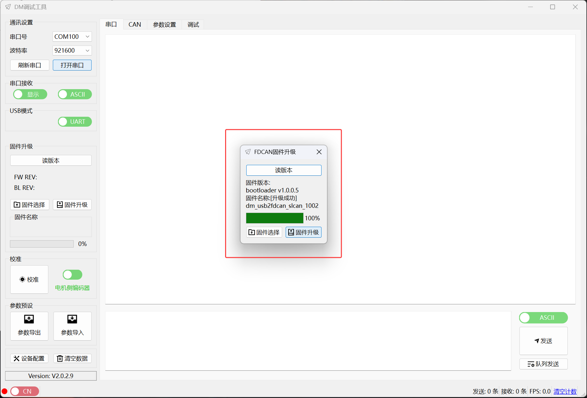
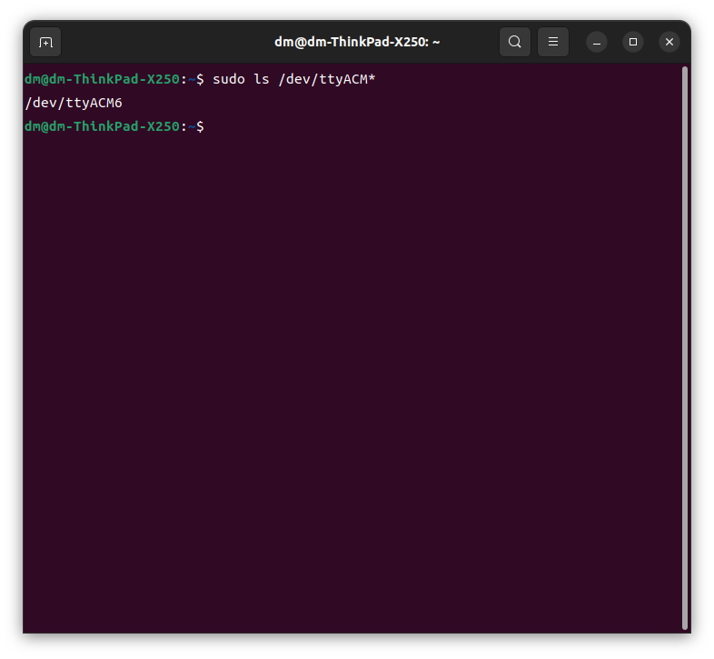
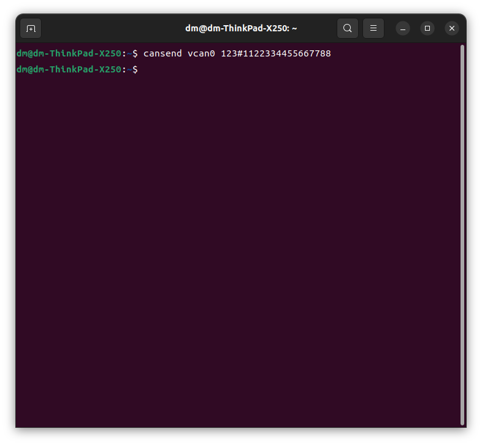
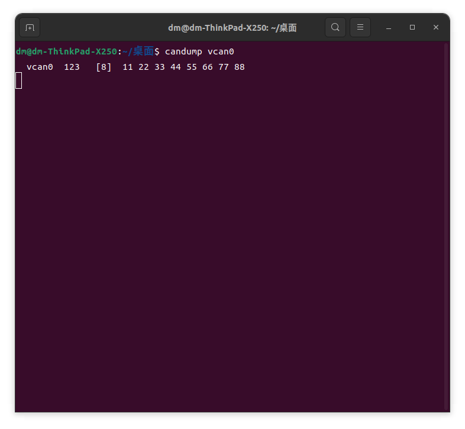

# SLCAN固件使用说明


### 简介

DM-USB转CANFD模块支持使用SLCAN固件以适配部分用户在Linux环境下的开发需求。通过下载仓库内的SLCAN固件，进入配套上位机中进行固件刷写，即可切换到SLCAN固件。


### 使用步骤


##### 1.前期准备工作

<u>下载slcan固件</u>（目前稳定发行的slcan固件版本为1.0.0.2）


<u>固件升级</u>

使用模块配套上位机工具进行固件升级，具体升级步骤请移步至模块说明书。

P.S. 出厂固件和SLCAN固件可以互相切换，如需换回出厂固件请重新刷入最新的出厂固件即可。



##### 2.查找设备

将模块插入使用Ubuntu系统的PC，执行下面指令查看设备是否存在

```bash
sudo ls /dev/ttyACM*
```



当前PC只插入了一个设备，可以看到存在一个虚拟串口号 **ttyACM6**


##### 3.添加设备

首先，确保你的Ubuntu系统已安装 `can-utils` 工具包，它包含了我们需要的各种CAN工具

```bash
sudo apt update
sudo apt install can-utils
```

使用 `slcand` 命令将你的串口设备映射为CAN接口（这里以 `/dev/ttyACM6` 为例，CAN波特率设为5Mbps，创建的CAN接口命名为 `vcan0`）：

```bash
sudo slcand -o -c -s8 /dev/ttyACM6 vcan0
```

◆CAN接口名可以按需设置

参数解析：

- `-o`：打开串行设备。
- `-c`：创建新的CAN接口。
- `-s8`：设置CAN波特率为5 Mbps 并开启CANFD功能
- `vcan0`：指定创建的CAN接口名称。

| 波特率参数 | 波特率 | CAN类型 |
| ---------- | ------ | ------- |
| -s0        | 100K   | CAN     |
| -s1        | 125K   | CAN     |
| -s2        | 200K   | CAN     |
| -s3        | 250K   | CAN     |
| -s4        | 500K   | CAN     |
| -s5        | 1000K  | CAN     |
| -s6        | 2000K  | CANFD   |
| -s7        | 4000K  | CANFD   |
| -s8        | 5000K  | CANFD   |

这一步成功后会看到CAN模块的灯变成**绿色慢闪**

##### 4.激活设备

创建好CAN接口后，需要将CAN接口打开，输入以下指令进行打开：

```bash
sudo ip link set up vcan0
```

其中vcan0是上面创建的CAN接口名称


##### 5.发送演示

激活设备后，使用cansend指令测试发送can数据帧：

```bash
cansend vcan0 123#1122334455667788
```



打开一个新的终端窗口，使用candump vcan0指令来查看can总线上的收发情况

```bash
candump vcan0
```



##### 6.关闭设备

当你不再需要CAN接口时，可以关闭并删除它：

```bash
sudo ip link set down vcan0    # 先关闭接口
sudo slcand -c /dev/ttyACM6  # 使用 slcand 关闭设备（具体命令可能略有差异）
# 或者通过杀掉 slcand 进程来清理
```


##### 7.切换CAN波特率

目前有两种方案来切换波特率

方法一：通过设备关闭与清理，重新打开新波特率设备（步骤请看上文）

方法二：通过使用slcan协议命令 模块无需使用slcan的关闭命令也可直接切换波特率

```bash
echo -e "S4\r" > /dev/ttyACM6  # 设置CAN波特率为500K 波特率序号看上文
```


### 测试情况

**官方测试条件**：串联9个43系列电机 末端挂载终端电阻 电机波特率5M 测试电机反馈帧上次更新到本次更新的时间间隔

**官方测试结果**：

- 9个电机1kHz收发 略微波动（存在少量的间隔波动）   稳定500Hz收发
- 7个电机稳定1kHz收发 稳定500Hz收发

